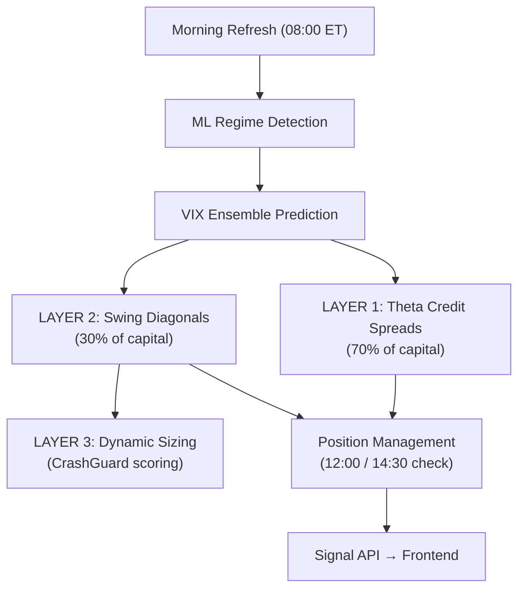
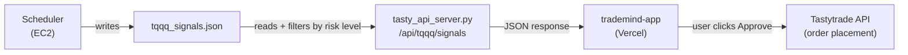

# TurboBounce Options — Comprehensive Strategy Report

## Executive Summary

**TurboBounce Options** is a fully automated, AI-powered options trading strategy on **TQQQ** (3× leveraged Nasdaq ETF). It does **NOT** pick daily gainers/losers across multiple stocks — it is laser-focused on **TQQQ only**, exploiting VIX regime shifts and mean-reversion bounces on this single, highly volatile instrument.

The system runs as a cron-scheduled process on EC2, scanning for entries 3× daily during market hours and checking positions 2× daily. It uses a **3-layer architecture** where each layer operates independently with isolated capital pools.

### Backtested Performance (2019–2025)

| Risk Profile | Annual Return | Sharpe | Max Drawdown |
|---|---|---|---|
| **Low (Conservative)** | **+117%** | **2.04** | **-4.7%** |
| Medium (Balanced) | +98% | 1.82 | -10% |
| High (Aggressive) | +135% | 1.65 | -18% |

---

## Architecture: Three Independent Layers

---

## Layer 1: Theta Credit Spreads (70% of Capital)

**Purpose**: Steady income via short premium, harvesting time decay on TQQQ options.

### How It Works

1. **VIX Regime Detection** (ML → rule-based fallback):
   - Classifies the market into 4 regimes: `LOW_VOL`, `NORMAL`, `HIGH_VOL`, `CRISIS`
   - Uses HMM (Hidden Markov Model) when available; falls back to rule-based VIX thresholds

2. **Spread Direction Selection**:
   - `LOW_VOL` / `NORMAL` / `HIGH_VOL` (VIX falling) → **Put Credit Spread** (bullish)
   - `HIGH_VOL` / `CRISIS` → **Bear Call Credit Spread** (bearish)

3. **Strike & DTE Selection** (DE-Optimized per regime):

   | Regime | DTE | Delta | Width | Profit Target | Stop Loss |
   |---|---|---|---|---|---|
   | LOW_VOL | 35 | -0.16 | $3 | 50% | 3.8× credit |
   | NORMAL | 30 | -0.18 | $5 | 56% | 3.2× credit |
   | HIGH_VOL | 21 | -0.24 | $5 | 82% | 2.3× credit |
   | CRISIS | 14 | -0.14 | $3 | 78% | 4.3× credit |

4. **Entry Gates**:
   - VIX 5-day filter: skip if VIX rose > 4.0 pts in last 5 days
   - ML confidence gate: minimum 60% AI confidence
   - Cooldown gate: configurable cooldown between entries
   - Liquidity filters: min volume 1000, min OI 2000, max spread $0.05
   - Optional intraday timing engine (ML)

5. **Exit Management** (via [VIXAdaptiveStrategy](file:///d:/Projects/tastywork-trading-1/src/tqqq/vix_adaptive_strategy.py#25-304) state machine):
   - Profit target hit → close
   - Loss limit hit (× credit multiplier) → close
   - Leg-out: buy back short for < 15% of credit, run the long side
   - DTE < 14 → close (avoid gamma risk near expiry)
   - Call rally circuit breaker: +5% TQQQ intraday → emergency close all call spreads

---

## Layer 2: Swing Diagonals / Backspreads (30% of Capital)

**Purpose**: Capture explosive mean-reversion bounces when TQQQ is deeply oversold.

### How It Works

1. **RSI-2 Dip Detection** — Three independent tranches with DE-optimized thresholds:

   | Tranche | RSI-2 Threshold | Capital Allocation | Structure |
   |---|---|---|---|
   | **Deep Oversold** | RSI < 5 | 40% of swing pool | **1×2 Call Backspread** |
   | **Moderate Dip** | RSI < 10 | 30% of swing pool | Put Diagonal Spread |
   | **Light Dip** | RSI < 15 | 30% of swing pool | Put Diagonal Spread |

2. **Hurst Exponent Gate** (H < 0.45):
   - Computed on rolling 60-day window
   - H < 0.50 = mean-reverting → good for swing trades
   - H > 0.50 = trending → skip (trend could continue lower)

3. **CrashGuard** — 6-Factor Scoring Engine (0–100 points, minimum 55 to enter):

   | Factor | Max Points | What It Measures |
   |---|---|---|
   | RSI-2 Depth | 25 pts | How oversold (RSI < 5 = max score) |
   | Distance from 200 SMA | 20 pts | Structural support (above SMA = full score) |
   | Hurst Exponent | 15 pts | Mean-reversion probability |
   | VIX Term Structure | 15 pts | Fear normalization (contango = bullish) |
   | Volume Capitulation | 10 pts | Wash-out selling (2× volume = max) |
   | ML Probability | 15 pts | AI bounce prediction confidence |

   **Hard Gates** (instant fail):
   - TQQQ > 25% below 200 SMA → blocked (falling knife)
   - Circuit breaker active → blocked

4. **Spread Construction** (DE-Optimized per tranche):
   - **Deep Oversold**: 1×2 Call Ratio Backspread (sell 1 ATM call, buy 2 OTM calls — positive gamma, benefits from explosive rebounds)
   - **Mod/Light**: Put Diagonal Spread (sell near-term OTM put, buy longer-dated further-OTM put — theta decay income with downside hedge)
   - Strike selection uses `anchor_dte`, `hedge_dte`, `anchor_k_pct`, `hedge_k_pct` from DE-optimized JSON params

---

## Layer 3: Dynamic Position Sizing

**Purpose**: Scale position size based on conviction level from CrashGuard.

| CrashGuard Score | Size Multiplier |
|---|---|
| 55–64 | 1.0× (base) |
| 65–74 | 1.2× |
| 75–84 | 1.6× |
| 85–100 | 2.0× (maximum) |

This means a deeply oversold RSI dip with strong SMA support, mean-reverting Hurst, bullish VIX structure, high volume capitulation, AND high ML confidence will trade at **double** the base size.

---

## Exit Engine: 5-Priority Cascade

When the scheduler checks positions (12:00 and 14:30 ET daily), swing positions go through this cascade:

| Priority | Trigger | Action |
|---|---|---|
| **P0: BP Stop Loss** | Unrealized loss > 15% of buying power consumed | Close all |
| **P1: Emergency** | TQQQ drops ≥ 10% from entry | Close all |
| **P2: Regime Collapse** | CrashGuard score < 30 | Close all |
| **P3: Bounce Profit** | TQQQ +5% from entry OR RSI-2 > DE-target (e.g. 65) | Close all |
| **P4: Theta Kicker** | Hedge DTE ≤ 1 AND score ≥ 50 AND < 10 days held | Roll hedge to new expiry |
| **P5: Time Stop** | Days held ≥ DE-optimized time stop (e.g. 15 days) | Close all |

The **Theta Kicker** is unique: if the hedge leg is about to expire but conditions are still favorable, it rolls the hedge instead of closing — squeezing out additional theta decay from the anchor leg.

---

## Daily Schedule (Eastern Time)

| Time | Action | Description |
|---|---|---|
| **08:00** | Morning Refresh | Fetch data, retrain ML if needed, classify VIX regime |
| **09:45** | Entry Scan #1 | Evaluate Layer 1 (theta) + Layer 2 (swing) entries |
| **10:30** | Entry Scan #2 | Second pass for opportunities missed at open |
| **12:00** | Position Check | Evaluate all open positions for exit/management |
| **14:30** | Entry Scan #3 + Position Check | Final entry window + position re-check |
| **15:45** | Pre-Close Check | Last-minute exit decisions before market close |
| **16:15** | EOD Report | Daily performance summary |

---

## ML & AI Components

| Component | Purpose | Model |
|---|---|---|
| `VIXRegimeDetector` | Classify VIX into 4 regimes | HMM / rule-based fallback |
| `VIXEnsemblePredictor` | Predict VIX direction (rising/falling/stable) | Ensemble (confidence 0–1) |
| [CrashGuard](file:///d:/Projects/tastywork-trading-1/src/tqqq/crash_guard.py#23-169) | 6-factor composite scoring for swing entry gating | Hand-crafted scoring engine |
| `IntradayTimingEngine` | Optimal intraday timing for theta entries | ML timing model (optional) |
| `ContractRanker` | Rank option contracts for optimal selection | XGBoost (`.ubj` model) |

---

## Risk Management

| Parameter | Value |
|---|---|
| Max concurrent theta spreads | 3 |
| Max concurrent swing positions | 3 |
| Max risk per trade | 8.4% of portfolio |
| BP reserve (never deployed) | 30% |
| Max portfolio drawdown → halt | 10% |
| Slippage model | 0.8% per leg |
| Capital isolation | Theta 70% / Swing 30% — never cross-contaminate |

---

## Signal Flow (Backend → Frontend)

1. Scheduler generates signals for **all 3 risk levels** simultaneously
2. Backend API filters to only show signals matching user's selected risk level
3. Frontend displays signals with risk level tag (Low/Medium/High Risk)
4. User can **Approve & Execute** (places order on Tastytrade) or **Track Only**
5. With `TQQQ_AUTO_TRADE=True`, the scheduler places orders automatically without user intervention

---

## What TurboBounce Does NOT Do

- ❌ Does NOT scan multiple stocks for daily gainers/losers
- ❌ Does NOT do stock picking or portfolio rotation
- ❌ Does NOT trade equities — **options only** on TQQQ
- ❌ Does NOT use fundamental analysis or earnings data

## What TurboBounce DOES Do

- ✅ Trades **one instrument** (TQQQ) with surgical precision
- ✅ Uses VIX regime as the primary driver for spread construction
- ✅ Detects oversold conditions via RSI-2 for mean-reversion swing trades
- ✅ Applies a 6-factor scoring engine (CrashGuard) to gate entries
- ✅ Uses DE (Differential Evolution) optimized parameters across 6 years of backtest data
- ✅ Manages exits with a 5-priority cascade including the unique "Theta Kicker" roll
- ✅ Isolates capital between theta income and swing bounce strategies
- ✅ Scales position size dynamically based on conviction (Layer 3)
